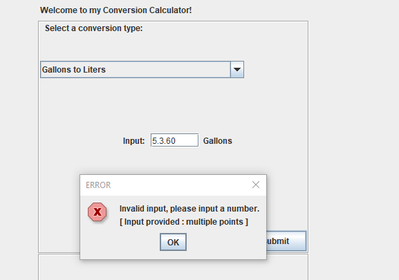
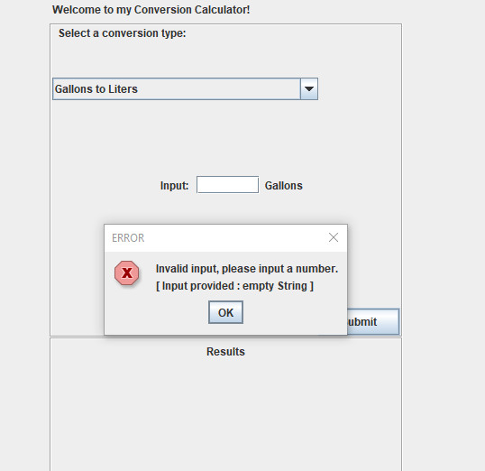
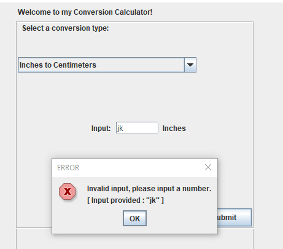

# ConversionCalculator

Upgraded my homework assignment, because Java really doesn't take more than a couple weeks to learn...

Yes, It could be refactored, but I'm already working on better things. More to come.

## Main Screen

## Calculation Performed

## Error Handling

### Double Dot

### Empty String / Whitespace

### Character/String Input

